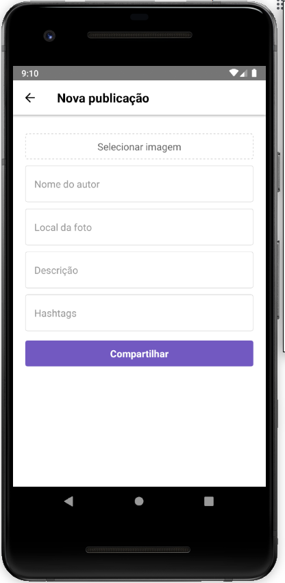

# Clone-Instagram 

> A clone of Instagram made using React

---

# :wrench: Stack

This project was created using [Express](https://expressjs.com/), [Socket.IO](https://socket.io/), [React](https://reactjs.org/) and [React Native](https://reactnative.dev/). The database used was [MongoDB](https://www.mongodb.com/).

# :construction_worker: Installation

**Once you have [Node.js](https://nodejs.org/en/download/) and [Yarn](https://yarnpkg.com/) installed, install the dependencies by running inside each folder:**

```bash
$ yarn
```

**Setup the API**

To start the server, inside the ```backend``` folder run:

```bash
$ yarn dev
```

# :rocket: Running the app

After doing the previous steps, inside the ```frontend``` folder run:

```bash
$ yarn start
```

To run the mobile version for the first time, go to the ```mobile``` folder and do:

```bash
$ react-native run-android
```

If you have already ran the app before, just enter:

```bash
$ react-native start
```

# :memo: License

This project is under the [MIT license](https://github.com/v1eira/clone-instagram/blob/master/LICENSE).

# :computer: Web


# :iphone: Mobile

<p align="center">
    
</p>

<p align="center">
    
</p>
